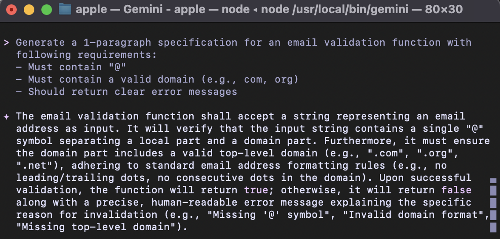

# AI-Driven Development — 30-Day Challenge - Task 2

## Part A - Theory (Short Questions)

### 1. Nine Pillars Undertanding

**Question 1.** Why is using AI Development Agents (like Gemini CLI) for repetitive setup tasks
better for your growth as a system architect?

**Answer:** Using AI Development Agents for repetitive setup tasks I will free for being a just a code typist, I will free to think as system architect following Nine Pillars understanding. It leads me to fast development, keep me focused on architecture, scalability, maintainability, cost, security, reliability etc. Moreover, on growing side I can learn patterns faster since agents generate setup code, I can compare different configs, scaffolds and architectures in moments. Furthermore, while setup friction is low, I can go through multiple prototypes by understanding distributed systems, serverless vs container designs, cost effectiveness etc. So, AI agents don't replace my growth, they push it by avoiding setup fatigues and handling syntax and boilerplates, which leads me to the high level engineering earlier.

**Question 2.** Explain how the Nine Pillars of AIDD help a developer grow into an M-Shaped Developer.

**Answer:** The Nine Pillars of AIDD push a developer to the next level of development skills instead of just coding skills. Those pillars enhance defining problems, system workflow design, breaking tasks, context management, handoffs, took calling, guardrails, evaluation and scaling letting a developer becoming an M-Shaped Developer. Commonly, devs have only one specialty which make them I-Shaped developer, however a broad generalists are T-Shaped devs. Thus, Nine Pillars of AIDD push a developer to think like an architect, engineer and system thinker which gives him a multiple deep skill columns that transforms him to M-Shaped Developer.

### 2. Vibe Coding vs Specification-Driven Development

**Question 1.** Why does Vibe Coding usually create problems after one week?

**Anwser:** Vibe Coding create problems after one week because nothing is clearly planned, every new idea changes old code, after a week integration feels like hell, solving the problem instantly without writing it you are unable to explain it later, bugs appear unexpectedly, codebase looks strange. So Vibe Coding pushes earlier but introduces unexpected hurdles later.

**Question 2.** How would Specification-Driven Development prevent those problems?

**Answer:** Specification-Driver Development prevent those problems because with SDD every thing is preplanned, we get no surprises, everything goes as per written specs, things kept in control even after a week. Moreover, if any updation is required things can easily be managed with specs updation. Development speed remains stable. With SDD code don't look strange after a week.

### 3. Architecture Thinking

**Question 1.** How does architecture-first thinking change the role of a developer in AIDD?

**Answer:** Architecture-first thinking change the role of developer in AIDD from stop remembering syntax to thinking in data flows, system design and workflows. It let developer focus on how should things happen not to just typing code. Developer becomes director of agents to shape the system instead of writing repetitive codes.

**Question 2.** Explain why developers must think in layers and systems instead of raw code.

**Answer:** Thinking in layers and systems do product stable, scalable and testable. Raw code scope can be fixing a component or spot but thinking in layers fix how system works. Thinking in raw code is block-scoped and thinking in layers and systems is global-scoped.

## Part B — Practical Task (Screenshot Required)

### Task: 
Using any AI CLI tool, generate a 1-paragraph specification for an email validation function.

### Requirements:

- Must contain “@”
- Must contain a valid domain (e.g., .com, .org)
- Should return clear error messages

### Submission:
1. Your exact CLI prompt (text or screenshot)
2. The 1-paragraph specification generated by the CLI

**Solution:**
 
**My Prompt:** Generate a 1-paragraph specification for an email validation function with following requirements:

- Must contain "@"                                                        
- Must contain a valid domain (e.g., com, org)
- Should return clear error messages 

**Generated by CLI:** ✦ The email validation function shall accept a string representing an email address as input. It will verify that the input string contains a single "@" symbol separating a local part and a domain part. Furthermore, it must ensure the domain part includes a valid top-level domain (e.g., ".com", ".org", ".net"), adhering to standard email address formatting rules (e.g., no leading/trailing dots, no consecutive dots in the domain). Upon successful validation, the function will return true; otherwise, it will return false along with a precise, human-readable error message explaining the specific reason for invalidation (e.g., "Missing '@' symbol", "Invalid domain format", "Missing top-level domain").

## Part C — Multiple Choice Questions

1. B
2. B
3. B
4. B
5. C