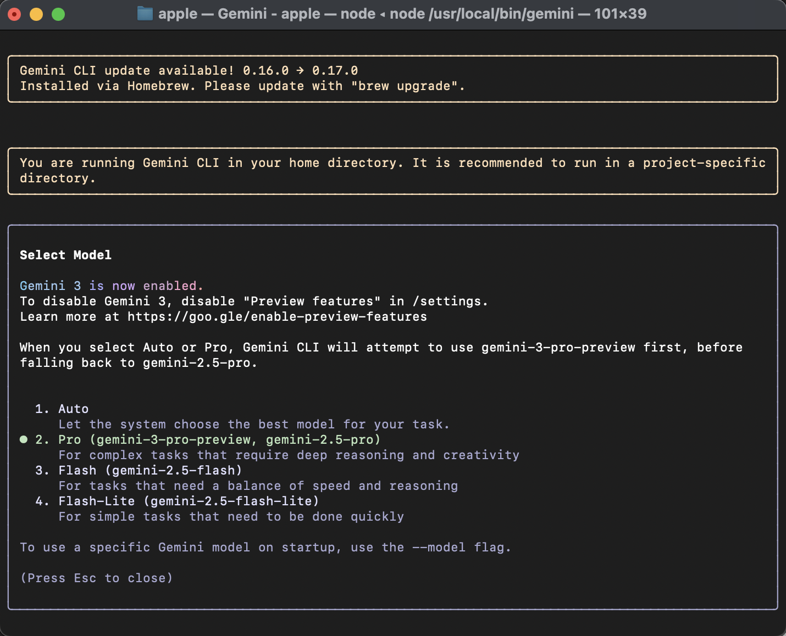

# AI-Driven Development - 30-Day Challenge Task-3

## PART A — Research Questions (Short Answers)

**Question 1.** What new improvements were introduced in Gemini 3.0?

**Answer:** Gemini 3.0 is most intelligent model, built on a foundation of state-of-the-art reasoning following improvements are introduced in the latest model:

* **Thinking**: A new specialized mode that allows the model to "think" for longer periods before responding. This is designed for challenging math, scientific, and logic problems, similar to OpenAI's o1 models. Prevously using prompt engineering (like chain-of-thought) to force Gemini 2.5 to reason, in Gemini 3.0 we can go with `thinking_level: "high"` and simplified prompts. We can set it to `low` for faster, lower-latency responses when complex reasoning isn't required. `medium` is currently not supported at launch tagged as coming soon. 
* **Google Antigravity:** A new agentic development platform was launched alongside Gemini 3.0. It is an IDE (Integrated Development Environment) designed for "agent-first" software development, allowing AI agents to act as active partners in building software rather than just assistants.

**Question 2.** How does Gemini 3.0 improve coding & automation workflows?

**Answer:**  Gemini 3.0 improves coding and automation workflows by making the model an autonomous agent capable of multi-step, complex work. It can plan, execute and fixing the errors through multi-step tasks. It introduces Google Antigravity an agentic development platform which allows AI agents to operate autonomously across `editor`, `terminal` and `browser`, the developer acts as the architect and the agent does setups and repetitive tasks.

**Question 3.** How does Gemini 3.0 improve multimodal understanding?

**Answer:** Gemini 3.0 improve multimodel understanding by resoning across and processes text, images, video, audio and code. It moves beyond processing separate data types to synthesizing information from all modalities at once.

**Question 4.** Name any two developer tools introduced with Gemini 3.0.

**Answer:** Two developer tools introduced with Gemini 3.0 are Google Antigravitiy and Thinking parameter.

## PART B — Practical Task (Screenshot Required)

